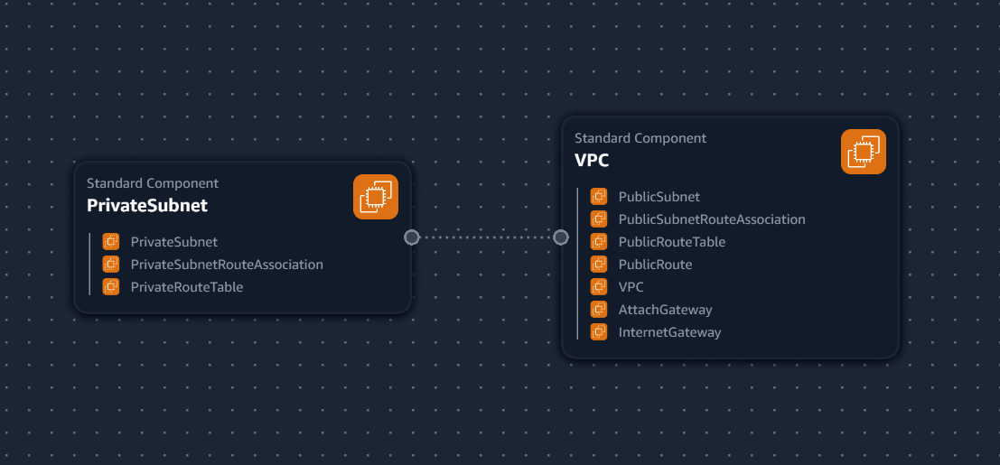
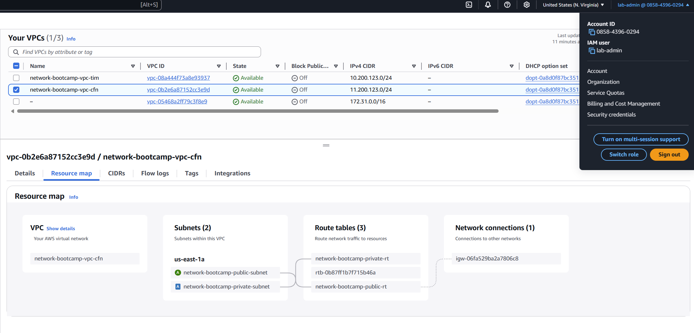
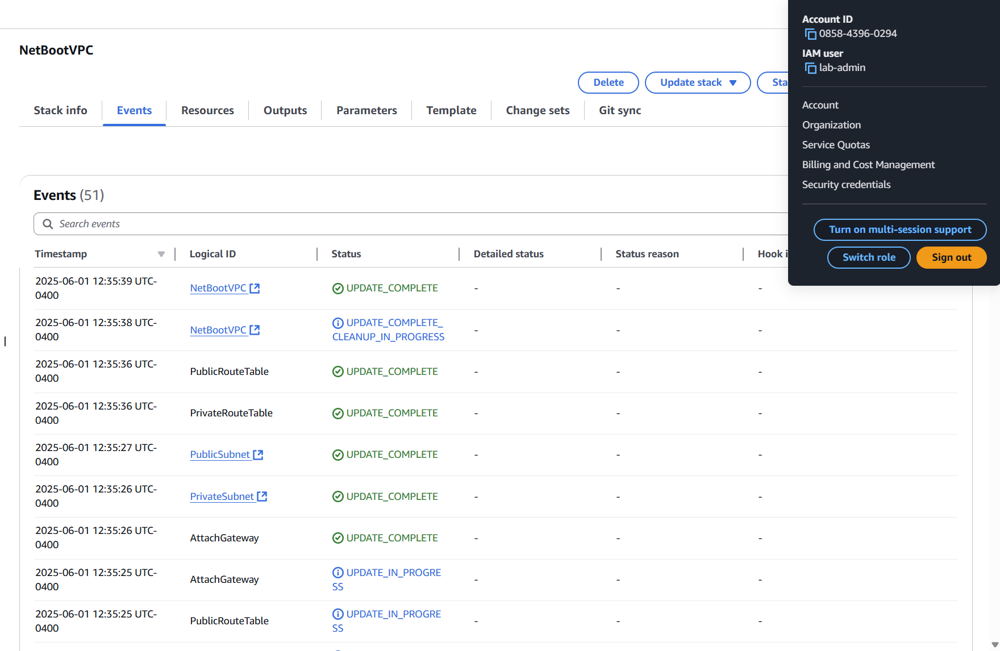

## Journaling

## VPC Settings

These are the VPC settings that Tim used in his video to to create the AWS Cloud Environment using ClickOps. I am going to use a different IP range for CFN automation to make is easier to identify.  

- VPC IPv4 CIDR Block: 11.200.123.0/24
- IPv6 CIDR Block: No
- Number of AZs: 1
- Number of private subnets: 1
- NAT Gateways: None
- VPC Endpoints: None
- DNS Options: Enable DNS Hostnames
- DNS Options: Enable DNS Resolution

## Generated and Reviewed CFN Template

Watching Tim's videos I noted the VPC settings and then fed that to ChatGPT to produce a basic CFN template for a VPC. This allows me to quickly deploy via automation.

I refactored the code a few times to make sure were were not hardcoding any unnecessary values in the templates. At this time I also included Name values to make resources easier to identify in the console.

## Generated Deploy Script

Using ChatGPT I generated a bash script, `bin/deploy`

I changed shebang to work for all OS platforms

## Debugging the deploy script

You may encounter these errors when running `.bin/deploy`

 `/usr/bin/env: ‘bash\r’: No such file or directory`
 `/usr/bin/env: use -[v]S to pass options in shebang lines`

 This can happen if there are Windows-style line endings (\r\n), even though you’re 
 running it in Ubuntu.

 To resolve, run the following:

`sed -i 's/\r$//' ./bin/deploy`

`chmod +x ./bin/deploy`

`./bin/deploy`

## Visualization in Infrastructure Composer

I thought we should visualize our VPC via Infrastructure Composer. Not the best but it's a start.

## Installing AWS CLI

AWS CLI is required to deploy. Follow the install guide here https://docs.aws.amazon.com/cli/latest/userguide/getting-started-install.html

## Deployed Resources to AWS

This is the resource map of the VPC deployed with CFN.

This is the Cloud Stack after my final changes

