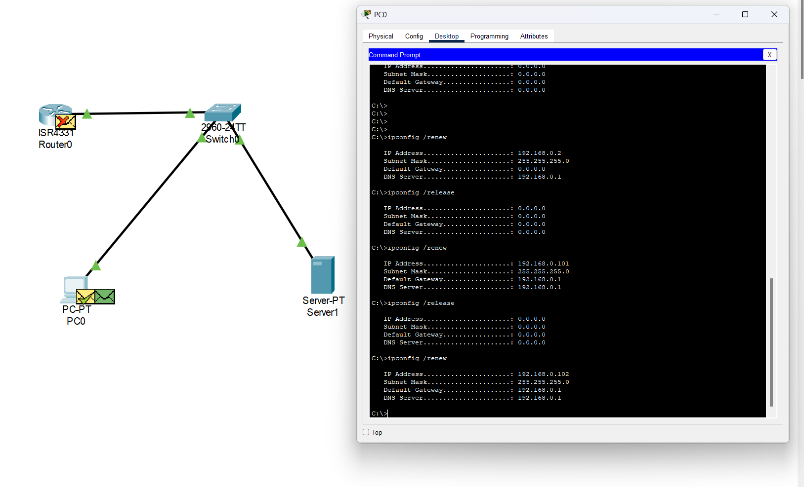

# State of the network

I viewed Tim's video on how to do some basic testing with Packet Tracer. We simuated network containing a switch, router, server, client (PC). 

In this screenshot, we can see an request to release and renew the IP was made from the client. Here we are seeing the new IP (192.168.0.102) being delivered to the client. 

- A command is entered on the PC0 to release its current IP address.
- A command is entered on the PC0 to request a new IP address from the DCHP service on Server1
- The request from PC01 is sent to Switch0
- Switch0 sends the reqest to Server1
- The DCHP services allcates an IP address and send the request back to Switch0
- Switch0 delievers the request to PC0 and now has a new IP address
