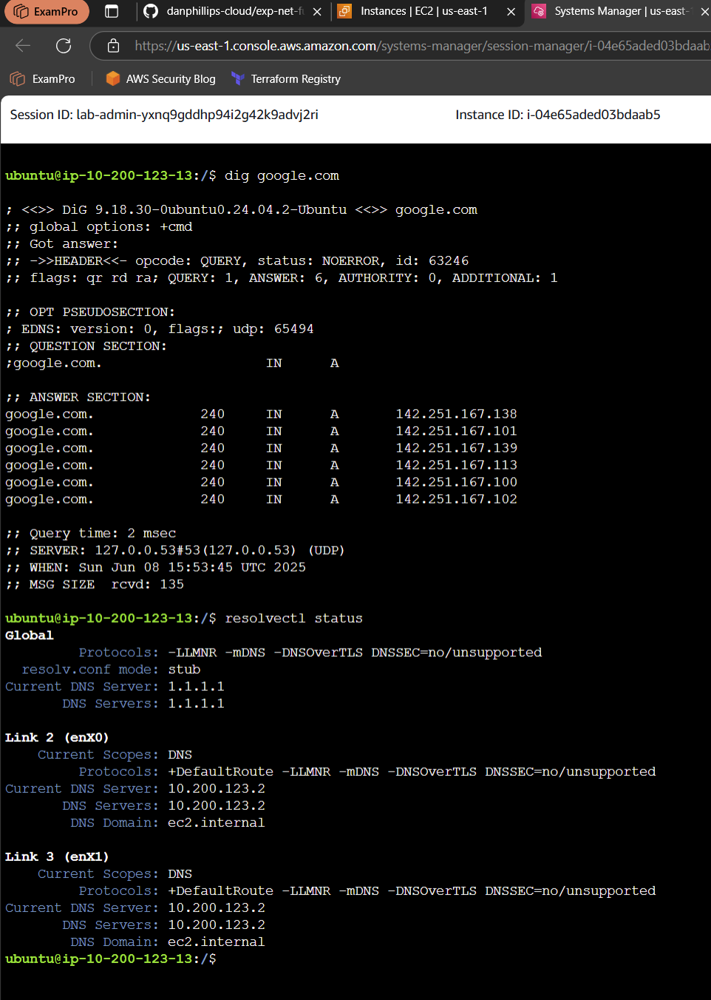
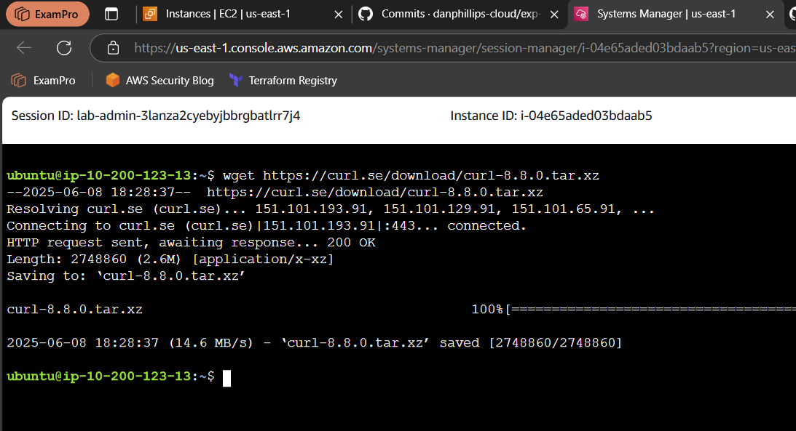
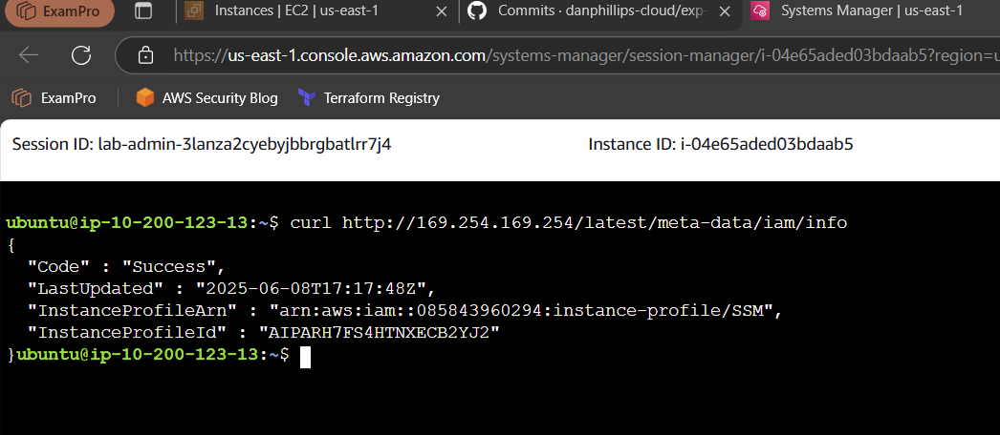

## Resolver

<documnet>

## A Quick Summary of wget vs curl

- **wget**  
  - Best for downloading files and websites (including recursively).
  - Works well for non-interactive, background downloads.
  - Saves files by default.
  - Limited protocol support (mainly HTTP, HTTPS, FTP).

- **curl**  
  - More versatile and scriptable.
  - Ideal for interacting with APIs (supports GET, POST, headers, etc.).
  - Outputs to stdout by default unless redirected.
  - Supports many protocols (HTTP, FTP, SFTP, SCP, LDAP, etc.).

## wget Example
This simple wget command downloads the curl tarball. 

## Curl Example
Here I access IAM metadata from inside an EC2 instance using the Instance Metadata Service (IMDS). This is required to enable Session Manager in AWS.

