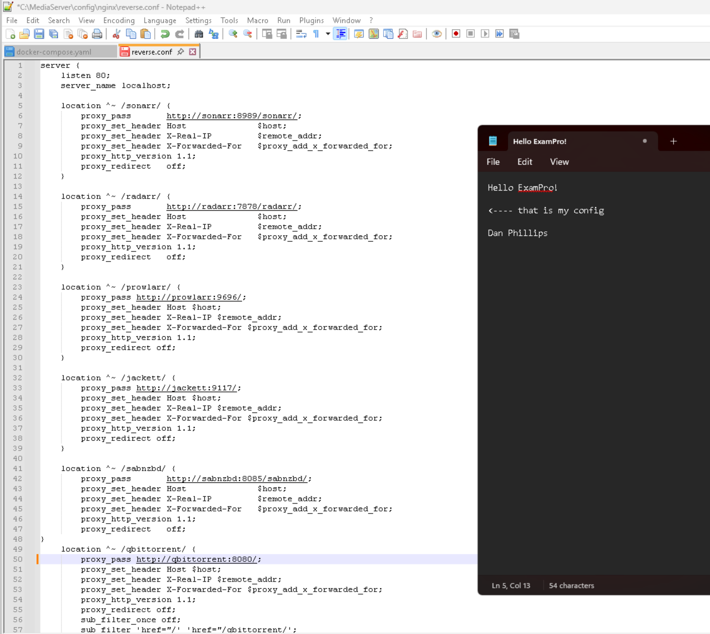

# NGINX Reverse Proxy for ARR Stack Services

I configured an NGINX reverse proxy to consolidate access to containerized services like Sonarr, Radarr, SABnzbd, Jackett, Prowlarr, and qBittorrent. Each service is accessible via a clean, path-based URL (e.g., `/sonarr`, `/radarr`) behind a single LAN IP and port.

---

## Objective

The goal was to simplify access to multiple media services without relying on custom ports or multiple IPs. By using NGINX and path-based routing, I created a centralized access point that’s easier to manage and navigate.

---

## Docker Network and Environment

All containers, including NGINX, run on the same custom Docker bridge network. This allows the reverse proxy to route traffic using container names as upstream hosts.

Example from `docker-compose.yml`:

```yaml
networks:
  media:
    driver: bridge

services:
  nginx:
    container_name: nginx
    networks:
      - media

  sonarr:
    container_name: sonarr
    networks:
      - media
```

## Key NGINX Proxy Blocks

I configured NGINX to route traffic based on subpaths. Each block sets headers correctly and rewrites or adjusts URLs as needed for the service to render properly.

## Sonarr and Radarr
These services require the path to be included in both the proxy_pass and the application’s own base URL setting:

```
location ^~ /sonarr/ {
    proxy_pass http://sonarr:8989/sonarr/;
    proxy_set_header Host $host;
    proxy_set_header X-Real-IP $remote_addr;
    proxy_set_header X-Forwarded-For $proxy_add_x_forwarded_for;
}
```
## SABnzbd

SABnzbd also expects its base path to match the one provided by the reverse proxy:

```
location ^~ /sabnzbd/ {
    proxy_pass http://sabnzbd:8085/sabnzbd/;
    proxy_set_header Host $host;
    proxy_set_header X-Real-IP $remote_addr;
    proxy_set_header X-Forwarded-For $proxy_add_x_forwarded_for;
}
```
## Jackett and Prowlarr

These services don’t require URL rewriting in the proxy pass and worked without additional config changes:
```
location ^~ /jackett/ {
    proxy_pass http://jackett:9117/;
    proxy_set_header Host $host;
}
```

## qBittorrent (with Sub-Filter)

qBittorrent does not support subpaths by default. To address this, I used sub_filter to rewrite internal links in HTML responses:

```location ^~ /qbittorrent/ {
    proxy_pass http://qbittorrent:8080/;
    proxy_set_header Host $host;
    sub_filter_once off;
    sub_filter 'href="/' 'href="/qbittorrent/';
    sub_filter 'src="/' 'src="/qbittorrent/';
}
```

## Lessons Learned

Applications like Sonarr, Radarr, and SABnzbd require that the base URL setting inside the app matches the proxy path.

Some apps (like Jackett and Prowlarr) work with minimal configuration.

qBittorrent required special handling with sub_filter, as it doesn't support subpaths natively.

Maintaining consistency with trailing slashes in both location and proxy_pass directives is important to prevent redirect issues.

Using a shared Docker network simplifies container-to-container routing and avoids exposing unnecessary ports.

## Outcome
By using NGINX as a reverse proxy with path-based routing, I was able to unify access to all *Arr services under a single IP and port (e.g., http://192.168.1.100/sonarr). This setup makes local access easier, cleaner, and more manageable.

