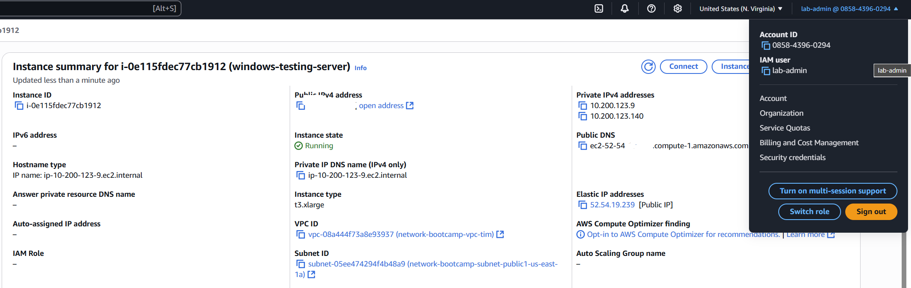
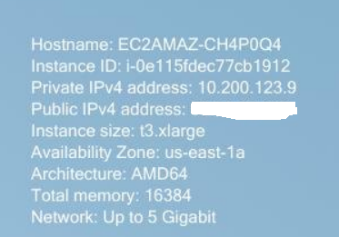

## Developer Enviornment

I did this exercise in my AWS account. I am using the VPC that Tim walked us through and am using an EC2 instance running Windows Server 2025.





## IPConfig

```sh
<C:\Users\Administrator>ipconfig

Windows IP Configuration


Ethernet adapter Ethernet:

   Connection-specific DNS Suffix  . : ec2.internal
   Link-local IPv6 Address . . . . . : fe80::6d1a:794e:26bb:788%3
   IPv4 Address. . . . . . . . . . . : 10.200.123.9
   Subnet Mask . . . . . . . . . . . : 255.255.255.240
   Default Gateway . . . . . . . . . : 10.200.123.1

Ethernet adapter Ethernet 2:

   Connection-specific DNS Suffix  . : ec2.internal
   Link-local IPv6 Address . . . . . : fe80::e1a3:2fe1:1154:e45e%15
   IPv4 Address. . . . . . . . . . . : 10.200.123.140
   Subnet Mask . . . . . . . . . . . : 255.255.255.240
   Default Gateway . . . . . . . . . : 10.200.123.129>
```

This the IP configuration of a Windows system network interfaces along with adaptors, gateways, and subnets.

## Ping

```sh
<
C:\Users\Administrator>ping exampro.co

Pinging exampro.co [108.138.64.122] with 32 bytes of data:
Reply from 108.138.64.122: bytes=32 time<1ms TTL=249
Reply from 108.138.64.122: bytes=32 time<1ms TTL=249
Reply from 108.138.64.122: bytes=32 time<1ms TTL=249
Reply from 108.138.64.122: bytes=32 time<1ms TTL=249

Ping statistics for 108.138.64.122:
    Packets: Sent = 4, Received = 4, Lost = 0 (0% loss),
Approximate round trip times in milli-seconds:
    Minimum = 0ms, Maximum = 0ms, Average = 0ms

C:\Users\Administrator>
>
```

This is a successful ping test to exampro.co, confirming network connectivity with no packet loss and sub-millisecond latency

## Trace Route

```sh
<C:\Users\Administrator>tracert google.com

Tracing route to google.com [172.253.115.138]
over a maximum of 30 hops:

  1    22 ms    12 ms    13 ms  100.100.8.70
  2     *        *        *     Request timed out.
  3     1 ms     1 ms     1 ms  100.100.36.102
  4     1 ms     1 ms     1 ms  99.83.115.171
  5     2 ms     3 ms     2 ms  192.178.105.219
  6     1 ms     1 ms     1 ms  192.178.243.4
  7     2 ms     2 ms     2 ms  142.251.49.187
  8     3 ms     3 ms     3 ms  142.251.226.101
  9     2 ms     2 ms     1 ms  142.250.209.36
 10     3 ms     2 ms     2 ms  172.253.66.159
 11     *        *        *     Request timed out.
 12     *        *        *     Request timed out.
 13     *        *        *     Request timed out.
 14     *        *        *     Request timed out.
 15     *        *        *     Request timed out.
 16     *        *        *     Request timed out.
 17     *        *        *     Request timed out.
 18     *        *        *     Request timed out.
 19     *        *        *     Request timed out.
 20     *        *        *     Request timed out.
 21     *        *        *     Request timed out.
 22     2 ms     2 ms     2 ms  bg-in-f138.1e100.net [172.253.115.138]

Trace complete.>
```

 This is a traceroute to google.com showing successful routing through multiple hops—with some intermediary nodes not responding to ICMP—but ultimately confirming reachability to the destination IP 172.253.115.138.

## Netsat

```sh
<C:\Users\Administrator>netstat

Active Connections

  Proto  Local Address          Foreign Address        State
  TCP    10.200.123.9:3389      38.23.181.110:58831    ESTABLISHED
  TCP    10.200.123.9:49775     104.208.203.90:https   ESTABLISHED
  TCP    10.200.123.9:49907     104.208.203.89:https   ESTABLISHED
  TCP    10.200.123.9:49932     wv-in-f101:https       TIME_WAIT
  TCP    10.200.123.9:49933     150.171.27.11:https    TIME_WAIT
  TCP    10.200.123.9:49934     a-0003:https           TIME_WAIT
  TCP    10.200.123.9:49936     150.171.28.11:http     TIME_WAIT
  TCP    10.200.123.9:49937     13.107.42.16:https     TIME_WAIT
  TCP    10.200.123.9:49938     pd-in-f132:https       TIME_WAIT
  TCP    10.200.123.9:49940     150.171.27.11:https    TIME_WAIT
  TCP    10.200.123.9:49941     20.190.151.6:https     ESTABLISHED
  TCP    10.200.123.9:49942     20.190.151.6:https     ESTABLISHED
  TCP    10.200.123.9:49943     172.183.192.109:https  TIME_WAIT
  TCP    10.200.123.9:49944     13.107.42.16:https     TIME_WAIT
  TCP    10.200.123.9:49945     a-0003:https           TIME_WAIT
  TCP    10.200.123.9:49948     server-3-167-37-85:https  TIME_WAIT
  TCP    10.200.123.9:49954     13.107.42.16:https     TIME_WAIT
  TCP    10.200.123.9:49955     a23-212-250-77:https   ESTABLISHED
  TCP    10.200.123.9:49956     150.171.27.11:https    ESTABLISHED
  TCP    10.200.123.9:49957     13.107.246.40:https    ESTABLISHED
  TCP    10.200.123.9:49960     150.171.27.11:https    ESTABLISHED
  TCP    10.200.123.9:49961     150.171.27.11:https    ESTABLISHED
  TCP    10.200.123.9:49962     bc-in-f95:https        ESTABLISHED
  TCP    10.200.123.9:49964     a23-62-166-208:https   ESTABLISHED
  TCP    10.200.123.9:49965     a23-62-166-208:https   ESTABLISHED
  TCP    10.200.123.9:49966     172.183.192.109:https  ESTABLISHED
  TCP    10.200.123.9:49967     20.110.205.119:https   ESTABLISHED
  TCP    10.200.123.9:49968     server-3-167-37-85:https  ESTABLISHED
  TCP    10.200.123.9:49970     13.89.178.26:https     ESTABLISHED
  TCP    10.200.123.9:49972     a23-48-10-36:https     ESTABLISHED
  TCP    10.200.123.9:49973     13.107.246.40:https    ESTABLISHED
  TCP    10.200.123.9:49974     13.107.246.40:https    ESTABLISHED
  TCP    10.200.123.9:49975     13.107.246.40:https    ESTABLISHED
  TCP    10.200.123.9:49976     13.107.246.40:https    ESTABLISHED
  TCP    10.200.123.9:49977     13.89.178.26:https     ESTABLISHED
  TCP    10.200.123.9:49978     13.107.246.40:https    ESTABLISHED
  TCP    10.200.123.9:49979     13.107.246.40:https    ESTABLISHED
  TCP    10.200.123.9:49980     a-0003:https           ESTABLISHED
  TCP    10.200.123.9:49982     a23-215-0-45:https     ESTABLISHED
  TCP    10.200.123.9:49983     104.16.175.226:https   ESTABLISHED
  TCP    10.200.123.9:49984     13.107.253.40:https    ESTABLISHED
  TCP    10.200.123.9:49986     13.107.246.40:https    ESTABLISHED
  TCP    10.200.123.9:49987     a23-50-125-135:https   ESTABLISHED
  TCP    10.200.123.9:49988     a23-62-164-9:https     ESTABLISHED
  TCP    10.200.123.9:49989     a23-50-125-135:https   ESTABLISHED
  TCP    10.200.123.9:49990     a23-62-164-9:https     ESTABLISHED
  TCP    10.200.123.9:49991     20.57.85.160:https     ESTABLISHED
  TCP    10.200.123.9:49992     13.69.116.108:https    ESTABLISHED
  TCP    10.200.123.9:49993     server-108-138-64-59:http  ESTABLISHED
  TCP    10.200.123.9:49994     server-108-138-64-59:http  ESTABLISHED
  TCP    10.200.123.9:49995     server-108-138-64-25:https  ESTABLISHED
  TCP    10.200.123.9:49996     server-3-167-112-124:https  ESTABLISHED
  TCP    10.200.123.9:49997     yuiadtq-in-f95:https   ESTABLISHED
  TCP    10.200.123.9:49998     13.69.116.108:https    ESTABLISHED
  TCP    10.200.123.9:49999     wv-in-f97:https        ESTABLISHED
  TCP    10.200.123.9:50000     104.26.5.196:https     ESTABLISHED
  TCP    10.200.123.9:50001     104.26.5.196:https     ESTABLISHED
  TCP    10.200.123.9:50002     104.16.80.73:https     ESTABLISHED
  TCP    10.200.123.9:50003     bg-in-f100:https       ESTABLISHED
  TCP    10.200.123.9:50004     bg-in-f156:https       ESTABLISHED
  TCP    10.200.123.9:50005     ww-in-f157:https       ESTABLISHED
  TCP    10.200.123.9:50006     wv-in-f97:https        ESTABLISHED
  TCP    10.200.123.9:50007     ww-in-f157:https       ESTABLISHED
  TCP    10.200.123.9:50008     204.16.244.92:https    ESTABLISHED
  TCP    10.200.123.9:50009     204.16.244.92:https    ESTABLISHED
  TCP    10.200.123.9:50011     204.16.244.92:https    ESTABLISHED
  TCP    10.200.123.9:50013     204.16.244.92:https    ESTABLISHED

C:\Users\Administrator>>
```

This is netstat command lists of all active network connections on the system when a user browses to exampro.co from the desktop. 

## Route

```sh
<C:\Users\Administrator>route print
===========================================================================
Interface List
  3...0e 7a 9f 2b d7 11 ......Amazon Elastic Network Adapter
 15...0e 4a 6c c8 71 61 ......Amazon Elastic Network Adapter #2
  1...........................Software Loopback Interface 1
===========================================================================

IPv4 Route Table
===========================================================================
Active Routes:
Network Destination        Netmask          Gateway       Interface  Metric
          0.0.0.0          0.0.0.0     10.200.123.1     10.200.123.9     20
          0.0.0.0          0.0.0.0   10.200.123.129   10.200.123.140     20
     10.200.123.0  255.255.255.240         On-link      10.200.123.9    276
     10.200.123.9  255.255.255.255         On-link      10.200.123.9    276
    10.200.123.15  255.255.255.255         On-link      10.200.123.9    276
   10.200.123.128  255.255.255.240         On-link    10.200.123.140    276
   10.200.123.140  255.255.255.255         On-link    10.200.123.140    276
   10.200.123.143  255.255.255.255         On-link    10.200.123.140    276
        127.0.0.0        255.0.0.0         On-link         127.0.0.1    331
        127.0.0.1  255.255.255.255         On-link         127.0.0.1    331
  127.255.255.255  255.255.255.255         On-link         127.0.0.1    331
  169.254.169.123  255.255.255.255         On-link      10.200.123.9     40
  169.254.169.249  255.255.255.255         On-link      10.200.123.9     40
  169.254.169.250  255.255.255.255         On-link      10.200.123.9     40
  169.254.169.251  255.255.255.255         On-link      10.200.123.9     40
  169.254.169.253  255.255.255.255         On-link      10.200.123.9     40
  169.254.169.254  255.255.255.255         On-link      10.200.123.9     40
        224.0.0.0        240.0.0.0         On-link         127.0.0.1    331
        224.0.0.0        240.0.0.0         On-link    10.200.123.140    276
        224.0.0.0        240.0.0.0         On-link      10.200.123.9    276
  255.255.255.255  255.255.255.255         On-link         127.0.0.1    331
  255.255.255.255  255.255.255.255         On-link    10.200.123.140    276
  255.255.255.255  255.255.255.255         On-link      10.200.123.9    276
===========================================================================
Persistent Routes:
  None

IPv6 Route Table
===========================================================================
Active Routes:
 If Metric Network Destination      Gateway
  1    331 ::1/128                  On-link
  3     40 fd00:ec2::123/128        On-link
  3     40 fd00:ec2::250/128        On-link
  3     40 fd00:ec2::253/128        On-link
  3     40 fd00:ec2::254/128        On-link
 15    276 fe80::/64                On-link
  3    276 fe80::/64                On-link
  3    276 fe80::6d1a:794e:26bb:788/128
                                    On-link
 15    276 fe80::e1a3:2fe1:1154:e45e/128
                                    On-link
  1    331 ff00::/8                 On-link
 15    276 ff00::/8                 On-link
  3    276 ff00::/8                 On-link
===========================================================================
Persistent Routes:
  None>
```

Windows routing table that shows how the system decides where to send network traffic, with two active network interfaces—each having its own gateway—allowing the machine to communicate across two connected subnets.